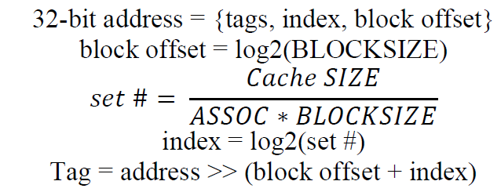
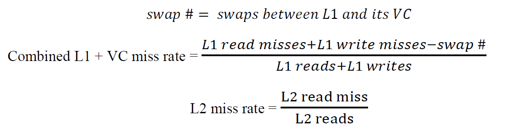
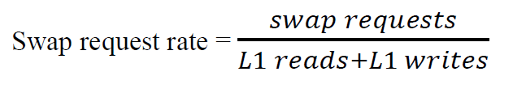
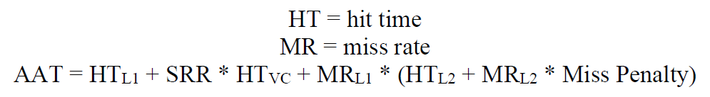
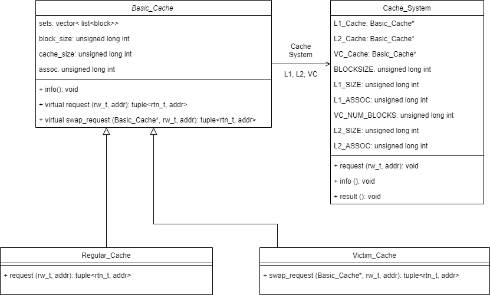

# project 1: Cache Design, Memory Hierarchy Design (C++)

# Table of Contents
  * [1. Introduction](#1-introduction)
  * [2. Formulas](#2-formulas)
    + [2.1 Address Decode](#21-address-decode)
    + [2.2 Cache Miss Rate](#22-cache-miss-rate)
    + [2.3 Swap Request Rate (SRR)](#23-swap-request-rate--srr-)
    + [2.4 Average Access Time (AAT)](#24-average-access-time--aat-)
  * [3. Cache Simulator](#3-cache-simulator)
  * [4. Experiments](#4-experiments)

## 1. Introduction 
In this project, I built a simulator that can simulate four types of memory hierarchy: L1 cache only, L1 cache + victim cache, L1 cache + L2 cache, L1 cache + victim cache + L2 cache. This project report analyzed various cache configurations, explained the relation between different block offsets, cache size, associativity, and victim cache. All cache is implemented in the least-recently-used (LRU) replacement policy and write-back + write-allocate (WBWA) write policy.

## 2. Formulas
### 2.1 Address Decode

### 2.2 Cache Miss Rate

### 2.3 Swap Request Rate (SRR)

### 2.4 Average Access Time (AAT)

## 3. Cache Simulator

## 4. Experiments
please refer **report.pdf** for more detail experiments and discussion.